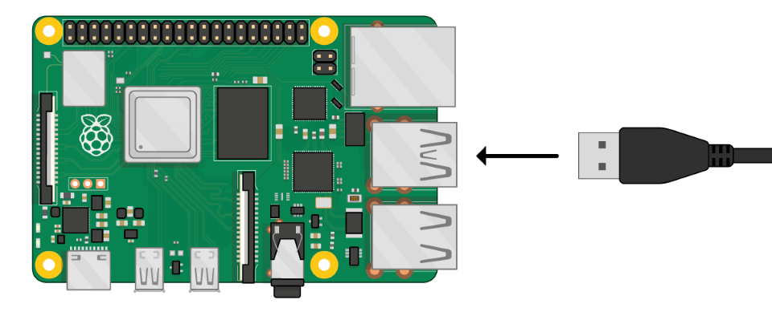
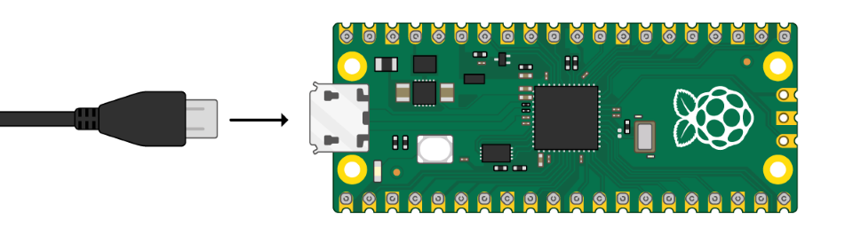
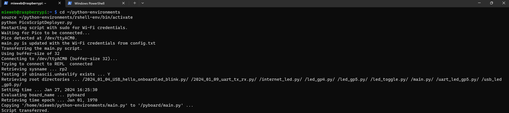

# About
When you run [`PicoScriptDeployer.py`](./PicoScriptDeployer.py), it retrieves the Wi-Fi SSID and password from the Pi and stores them in [`config.txt`](./config.txt). It doesn't overwrite existing credentials in [`config.txt`](./config.txt) if it can't find new ones. The script waits for a Pico to connect to the Pi. Once connected, it updates the Wi-Fi credentials in [`main.py`](./main.py) using the information from [`config.txt`](./config.txt) and then transfers [`main.py`](./main.py) to the Pico.

## Installation of Prerequisites
* Open terminal in Raspberry Pi and enter the below commands to install `rshell`.
``` bash
sudo apt update
mkdir ~/python-environments
cd ~/python-environments
python3 -m venv rshell-env
source ~/python-environments/rshell-env/bin/activate
pip install rshell
```

## Running the code
* Copy [`PicoScriptDeployer.py`](./PicoScriptDeployer.py), [`config.txt`](./config.txt), [`main.py`](./main.py) (code file that needs to run on pico) to the path `~/python-environments`.
* Open terminal on the Raspberry Pi and enter below commands to run the code.
``` bash
cd ~/python-environments
source ~/python-environments/rshell-env/bin/activate
sudo python PicoScriptDeployer.py
```

## Setup
* Connect Pico-W (the target board) to the Pi through usb cable.




## Developer Notes
* The [`main.py`](./main.py) will be deployed only to the most recently connected Pico if multiple Picos are attached to the Pi.
* If [`PicoScriptDeployer.py`](./PicoScriptDeployer.py) cannot detect your Wi-Fi details, you can manually update [`config.txt`](./config.txt) with the correct credentials.
* Files in the [`extras`](./extras) folder are optional for this project. See the points below for more details.
* Run [`wifi_cred_getter.py`](./extras/wifi_cred_getter.py) on the Pi to retrieve its wifi SSID and password, and save these details in [`config.txt`](./config.txt). 
* Run [`PicoJustScriptDeployer.py`](./extras/PicoJustScriptDeployer.py) on the Pi connected to the Pico to deploy [`main.py`](./main.py) on the Pico without modifying the wifi credentials. 
* Run [`pico_id_getter.py`](./extras/pico_id_getter.py) on the Pi connected to the Pico to get the Pico VID and PID.